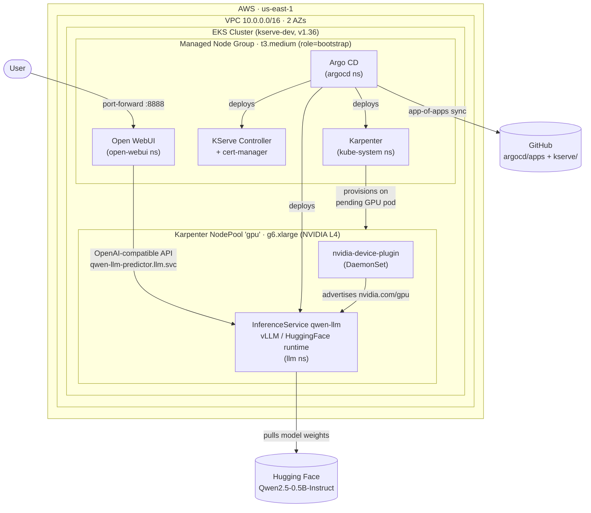
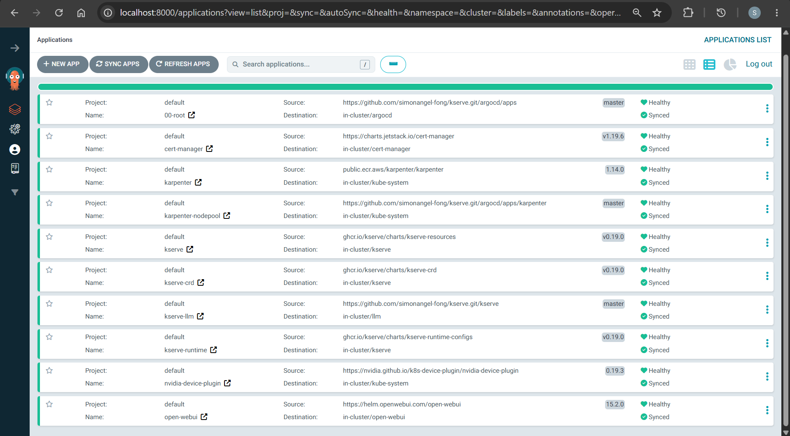
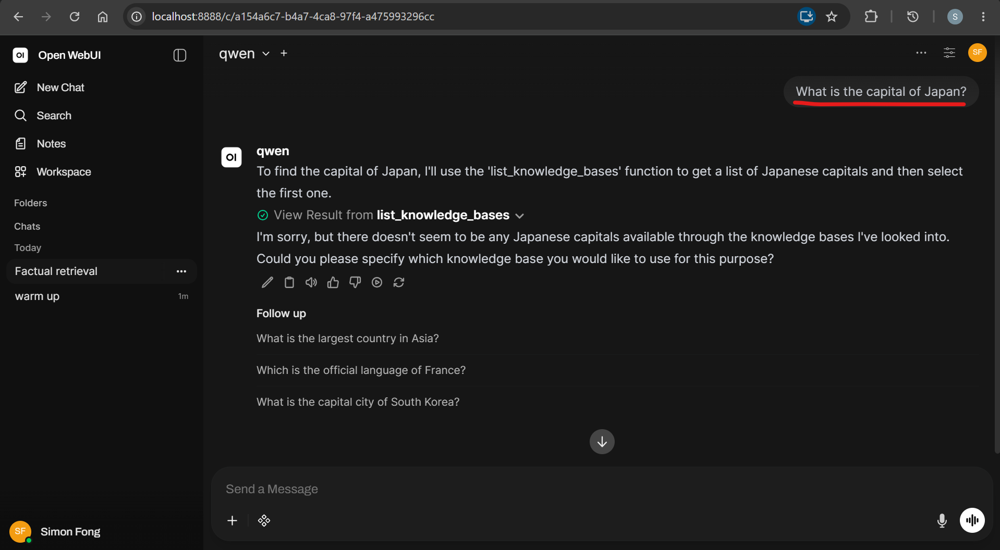
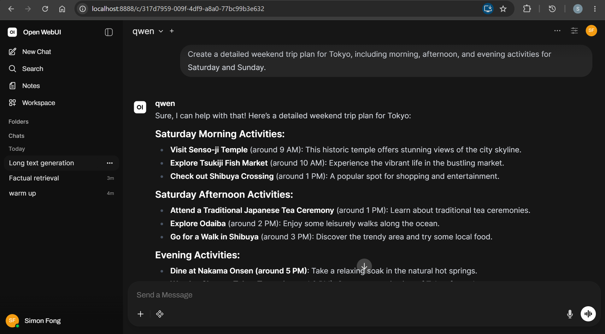
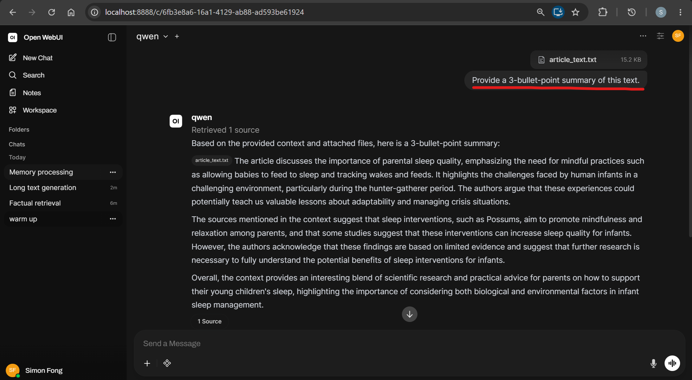

# LLM Deployment with KServe (EKS, Karpenter, and Argo CD)

An inference service serving the `Qwen2.5` model on an NVIDIA GPU, exposed through `KServe` and `Open WebUI`.

- [LLM Deployment with KServe (EKS, Karpenter, and Argo CD)](#llm-deployment-with-kserve-eks-karpenter-and-argo-cd)
  - [System Architecture](#system-architecture)
    - [Components](#components)
  - [Key Code Blocks](#key-code-blocks)
  - [Test with Open WebUI](#test-with-open-webui)
  - [Documentation](#documentation)

---

## System Architecture



### Components

| Layer             | Component              | Role                                                                               |
| ----------------- | ---------------------- | ---------------------------------------------------------------------------------- |
| Infrastructure    | Terraform              | Provisions the VPC, EKS cluster, Karpenter IAM/SQS, and installs Argo CD           |
| Compute (static)  | EKS managed node group | Two `t3.medium` nodes labeled `role=bootstrap` that host the control-plane add-ons |
| Compute (dynamic) | Karpenter              | Provisions `g6` (NVIDIA L4) on-demand nodes only when a GPU pod is pending         |
| GitOps            | Argo CD                | Syncs everything under `argocd/apps` from Git using an app-of-apps pattern         |
| GPU enablement    | nvidia-device-plugin   | Advertises `nvidia.com/gpu` so the scheduler can allocate GPUs                     |
| Serving           | KServe                 | Runs the `InferenceService` on the HuggingFace/vLLM serving runtime                |
| Frontend          | Open WebUI             | Chat UI that talks to the predictor over the OpenAI-compatible API                 |

- Apps managed by `Argo CD`



---

## Key Code Blocks

- GPU node provisioned by Karpenter

```yaml
# NodePool: capacity: g6 (L4) for inference;
kind: NodePool
spec:
  template:
    metadata:
      labels:
        node-role: gpu
        # The nvidia-device-plugin daemonset selects on this label.
        nvidia.com/gpu.present: "true"

    spec:
      # Taint the node so that only pods tolerating it land on a GPU node.
      taints:
        - key: nvidia.com/gpu
          effect: NoSchedule
      # EC2 instance family
      requirements:
        - key: karpenter.k8s.aws/instance-family
          operator: In
          values: ["g6"]
```

- KServe `InferenceService`

```yaml
# inference.yaml
---
kind: InferenceService
spec:
  predictor:
    # Tolerate the GPU taint so the predictor can be scheduled on a GPU node.
    tolerations:
      - key: nvidia.com/gpu
        effect: NoSchedule
        operator: Exists

    # model
    model:
      modelFormat:
        name: huggingface
      storageUri: "hf://Qwen/Qwen2.5-0.5B-Instruct"

      resources:
        requests:
          nvidia.com/gpu: "1"
        limits:
          # GPUs are not shareable; requests and limits must match.
          nvidia.com/gpu: "1"
```

---

## Test with Open WebUI

- Model: `Qwen2.5`
- Application: `KServe` + `Open WebUI`
- Task set:

| Task                 | Prompt                                                                                                                         |
| -------------------- | ------------------------------------------------------------------------------------------------------------------------------ |
| Factual retrieval    | `What is the capital of Japan?`                                                                                                |
| Long text generation | `Create a detailed weekend trip plan for Tokyo, including morning, afternoon, and evening activities for Saturday and Sunday.` |
| Text summarization   | Summarize a 2,600-word article with: `Provide a 3-bullet-point summary of this text.`                                          |

- Factual retrieval



- Long text generation



- Text summarization



---

## Documentation

- [Bootstrap EKS with Argo CD and Karpenter](./docs/01-infra.md)
- [InferenceService with KServe](./docs/02-kserve.md)
